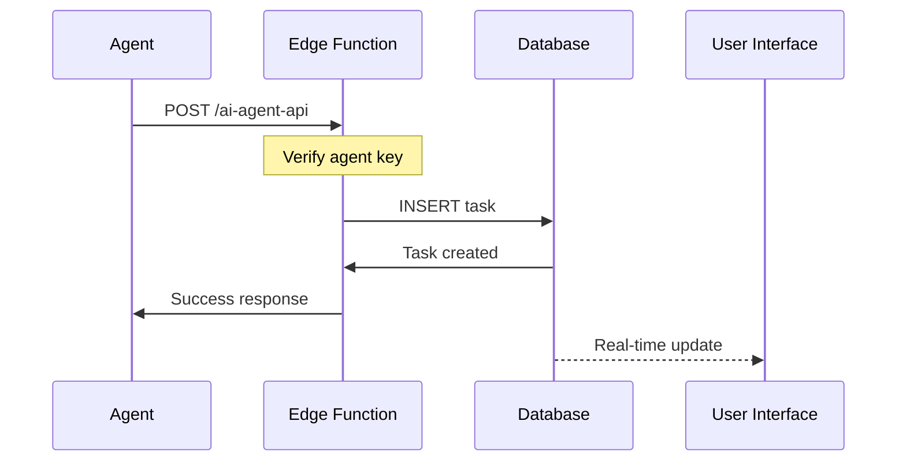

# AI Agent Integration Architecture

## Overview
The AI Agent Integration enables autonomous task management through OpenAI-powered agents that can analyze, create, and manage tasks in your Task Management App. The system uses a secure, scalable architecture with Supabase Edge Functions as the API layer.

## System Architecture

```
┌─────────────────────────────────────────────────────────────────┐
│                         User Interface                          │
│                    (Task Management App)                        │
└────────────────────────┬────────────────────────────────────────┘
                         │
┌────────────────────────┴────────────────────────────────────────┐
│                    Supabase Backend                             │
│  ┌──────────────────────────────────────────────────────────┐  │
│  │                  PostgreSQL Database                      │  │
│  │  • tasks        • projects      • organizations          │  │
│  │  • profiles     • comments      • activity_logs          │  │
│  └──────────────────────────────────────────────────────────┘  │
│                             ▲                                   │
│                             │ RLS                               │
│  ┌──────────────────────────┴────────────────────────────────┐ │
│  │                   Edge Functions (Deno)                    │ │
│  │  ┌─────────────────┐  ┌──────────────────┐               │ │
│  │  │  ai-agent-api   │  │ ai-task-processor│               │ │
│  │  │                 │  │                  │               │ │
│  │  │ • List tasks    │  │ • Analyze tasks  │               │ │
│  │  │ • Create tasks  │  │ • Process emails │               │ │
│  │  │ • Update tasks  │  │ • Generate plans │               │ │
│  │  │ • Find suitable │  │                  │               │ │
│  │  └────────┬────────┘  └──────────┬───────┘               │ │
│  └───────────┼───────────────────────┼───────────────────────┘ │
└──────────────┼───────────────────────┼──────────────────────────┘
               │                       │
               │ x-agent-key Auth      │ OpenAI API
               │                       │
┌──────────────┴───────────────────────┴──────────────────────────┐
│                    Python Agent Swarm                            │
│  ┌────────────────────────────────────────────────────────────┐ │
│  │                 Coordinator Agent                           │ │
│  │         (Orchestrates task distribution)                    │ │
│  └──────────────────────┬──────────────────────────────────────┘ │
│                         │                                        │
│  ┌──────────────────────┼──────────────────────────────────────┐ │
│  │                Specialized Agents                           │ │
│  │  ┌──────────┐  ┌──────────┐  ┌──────────┐  ┌──────────┐  │ │
│  │  │Developer │  │  Writer  │  │    QA    │  │ Research │  │ │
│  │  │  Agent   │  │  Agent   │  │  Agent   │  │  Agent   │  │ │
│  │  └──────────┘  └──────────┘  └──────────┘  └──────────┘  │ │
│  └──────────────────────────────────────────────────────────────┘ │
│                                                                   │
│  ┌──────────────────────────────────────────────────────────────┐ │
│  │                    Email Processor Agent                     │ │
│  │            (Extracts tasks from emails/transcripts)          │ │
│  └──────────────────────────────────────────────────────────────┘ │
└───────────────────────────────────────────────────────────────────┘
                               │
                               │ OpenAI GPT-4O
                               ▼
                    ┌──────────────────────┐
                    │   OpenAI API         │
                    │   (GPT-4O Model)     │
                    └──────────────────────┘
```

## Components

### 1. Edge Functions Layer
Located in `/agent-integration/edge-functions/`

#### ai-agent-api
- **Purpose**: CRUD operations for tasks and projects
- **Authentication**: Agent key verification
- **Endpoints**:
  - `list_tasks`: Retrieve tasks with filters
  - `create_task`: Create new tasks
  - `update_task`: Modify existing tasks
  - `assign_task`: Assign tasks to users
  - `create_project`: Create new projects
  - `analyze_workload`: Analyze task distribution
  - `find_suitable_agent_tasks`: Identify automation candidates

#### ai-task-processor
- **Purpose**: AI-powered task analysis and processing
- **Model**: GPT-4O (OpenAI)
- **Capabilities**:
  - Task automation analysis
  - Email/transcript processing
  - Task plan generation

### 2. Python Agent Swarm
Located in `/agent-integration/python-agents/`

#### Core Components

**Task Management Tools** (`task_management_tools.py`)
- Python wrappers for Edge Function APIs
- Function tools decorated for agent use
- Handles authentication and request formatting

**Agent Swarm** (`agent_swarm.py`)
- Multi-agent orchestration system
- Specialized agent definitions
- Task routing and delegation logic

#### Agent Types

1. **Coordinator Agent**
   - Role: Central orchestrator
   - Responsibilities:
     - Analyze workload across system
     - Identify suitable tasks for automation
     - Delegate to specialized agents
     - Monitor progress

2. **Developer Agent**
   - Role: Handle code-related tasks
   - Capabilities:
     - Code review tasks
     - Bug fix coordination
     - API documentation
     - Technical implementation planning

3. **Writer Agent**
   - Role: Content creation and documentation
   - Capabilities:
     - Documentation writing
     - README updates
     - User guide creation
     - Content editing

4. **QA Agent**
   - Role: Quality assurance and testing
   - Capabilities:
     - Test case creation
     - Bug report analysis
     - Test plan development
     - Quality metrics tracking

5. **Research Agent**
   - Role: Information gathering and analysis
   - Capabilities:
     - Market research tasks
     - Competitive analysis
     - Technology evaluation
     - Best practices research

6. **Email Processor Agent**
   - Role: Extract actionable items from communications
   - Capabilities:
     - Parse emails for action items
     - Extract tasks from meeting notes
     - Identify priorities and deadlines
     - Suggest task assignments

### 3. Authentication & Security

#### Multi-Layer Security
1. **JWT Verification**: Edge Functions require valid Supabase JWT
2. **Agent Key Authentication**: Secondary auth using `x-agent-key` header
3. **Service Role Key**: Backend operations use service role for full access
4. **Activity Logging**: All agent actions logged to `activity_logs` table

#### Environment Variables
```env
# Supabase Configuration
SUPABASE_URL=https://your-project.supabase.co
SUPABASE_ANON_KEY=your-anon-key
SUPABASE_SERVICE_ROLE_KEY=your-service-key  # Only for backend

# AI Agent Secret
AI_AGENT_SECRET_KEY=secure-random-key

# OpenAI Configuration
OPENAI_API_KEY=sk-...your-key
```

## Data Flow

### Task Analysis Flow
1. Agent requests task list via `ai-agent-api`
2. Edge Function queries database with RLS
3. Tasks returned to agent
4. Agent sends task to `ai-task-processor` for analysis
5. GPT-4O analyzes automation potential
6. Results returned to agent
7. Agent takes appropriate action

### Email Processing Flow
1. Email content sent to Email Processor Agent
2. Agent forwards to `ai-task-processor` Edge Function
3. GPT-4O extracts actionable items
4. Structured tasks returned
5. Agent creates tasks via `ai-agent-api`
6. Tasks appear in user interface

### Task Creation Flow


## API Reference

### Task Operations

#### List Tasks
```python
POST /functions/v1/ai-agent-api
{
  "action": "list_tasks",
  "params": {
    "status": "todo",
    "project_id": "uuid",
    "limit": 100
  }
}
```

#### Create Task
```python
POST /functions/v1/ai-agent-api
{
  "action": "create_task",
  "params": {
    "title": "Task title",
    "description": "Task details",
    "project_id": "uuid",
    "priority": "high",
    "due_date": "2025-09-10"
  }
}
```

### AI Processing

#### Analyze Task
```python
POST /functions/v1/ai-task-processor
{
  "action": "analyze_task",
  "data": {
    "task": {
      "title": "Update documentation",
      "description": "...",
      "priority": "medium",
      "status": "todo"
    }
  }
}
```

#### Process Email
```python
POST /functions/v1/ai-task-processor
{
  "action": "process_email",
  "data": {
    "content": "Email body text...",
    "metadata": {
      "sender": "john@example.com",
      "subject": "Meeting notes"
    }
  }
}
```

## Usage Examples

### Running the Agent Swarm
```python
from agent_swarm import TaskManagementSwarm

# Initialize swarm
swarm = TaskManagementSwarm(organization_id="your-org-id")

# Analyze and assign tasks
result = await swarm.analyze_and_assign_tasks()

# Process email
email_result = await swarm.process_email(
    email_content="Meeting notes...",
    metadata={"sender": "john@example.com"}
)
```

### Direct API Usage
```python
import requests

headers = {
    'Authorization': f'Bearer {SUPABASE_ANON_KEY}',
    'x-agent-key': AI_AGENT_SECRET_KEY,
    'Content-Type': 'application/json'
}

# Create a task
response = requests.post(
    f"{SUPABASE_URL}/functions/v1/ai-agent-api",
    headers=headers,
    json={
        "action": "create_task",
        "params": {
            "title": "New task from agent",
            "project_id": "project-uuid",
            "priority": "high"
        }
    }
)
```

## Monitoring & Logging

### Activity Tracking
All agent actions are logged to the `activity_logs` table:
```sql
SELECT * FROM activity_logs 
WHERE user_id = 'ai-agent' 
ORDER BY created_at DESC;
```

### Edge Function Logs
```bash
# View function logs
supabase functions logs ai-agent-api
supabase functions logs ai-task-processor
```

### Performance Metrics
- Task analysis: ~2-3 seconds per task
- Email processing: ~3-5 seconds per email
- Task creation: <1 second
- Batch operations: Up to 100 tasks per request

## Error Handling

### Common Issues

1. **Authentication Errors**
   - Verify AI_AGENT_SECRET_KEY matches in all configs
   - Ensure Bearer token is included for JWT verification

2. **OpenAI API Errors**
   - Check API key validity
   - Verify model availability (GPT-4O)
   - Monitor rate limits

3. **Database Errors**
   - Confirm project_id exists
   - Check organization_id is valid
   - Verify user permissions

## Future Enhancements

### Planned Features
1. **Autonomous Execution**: Agents complete tasks independently
2. **Learning System**: Agents improve based on feedback
3. **Custom Agent Types**: User-defined specialized agents
4. **Webhook Integration**: External service connections
5. **Voice Interface**: Process voice commands and transcripts

### Scalability Considerations
- Edge Functions: 500K invocations/month (free tier)
- OpenAI API: Rate limits based on tier
- Database: Automatic scaling with Supabase
- Concurrent agents: Currently 5, expandable to 20+

## Cost Analysis

### Per Operation Costs
- Task Analysis: ~$0.01-0.02 (GPT-4O)
- Email Processing: ~$0.02-0.03 (GPT-4O)
- Database Operations: Minimal (<$0.001)
- Edge Function Invocations: Free up to 500K/month

### Monthly Estimates (1000 operations)
- OpenAI API: ~$20-30
- Supabase: Free tier sufficient
- Total: ~$20-30/month

## Security Best Practices

1. **Never expose service role key** in client-side code
2. **Rotate agent keys** regularly
3. **Monitor activity logs** for suspicious behavior
4. **Rate limit** agent operations
5. **Validate all inputs** before database operations
6. **Use environment variables** for all secrets
7. **Enable audit logging** for compliance

## Conclusion

The AI Agent Integration provides a robust, scalable system for autonomous task management. By combining Supabase's backend infrastructure with OpenAI's language models, the system can intelligently analyze, create, and manage tasks while maintaining security and performance.

The modular architecture allows for easy extension with new agent types and capabilities, making it adaptable to evolving business needs.